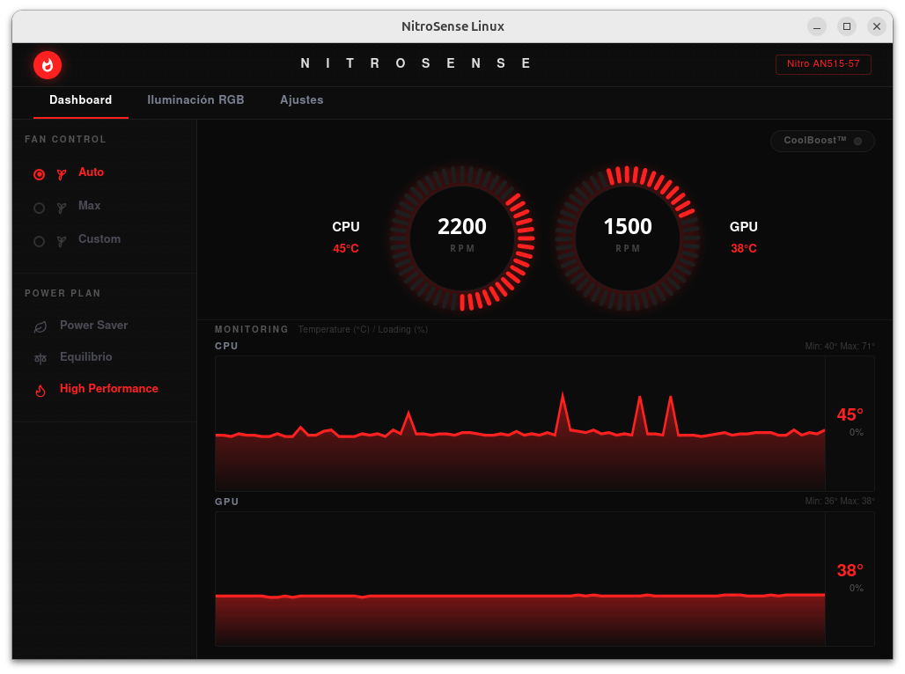

# NitroSense for Linux

A native, modern, and fully functional alternative to Acer NitroSense designed specifically for Linux (Ubuntu/Debian). It allows you to control fan speeds, customize RGB keyboard lighting, monitor real-time temperatures, and sync power profiles on Acer Nitro series laptops.



## ✨ Features

- **Fan Control**: Auto, Max, and Custom modes (with real-time synchronization and RPM readings via NBFC).
- **RGB Keyboard Customization**: Full control over the 4 keyboard zones, solid colors, and dynamic effects (Neon, Wave, Breathing) via the `facer` module.
- **Real-time Monitoring**: Live graphs and temperature sensors for both CPU (`coretemp`) and GPU (`nvidia-smi`).
- **Power Plans**: Bidirectional synchronization with GNOME/Linux Power Profiles.
- **Dedicated "N" Key Support**: Launch the app globally by pressing the physical NitroSense button on your keyboard.
- **Modern Interface**: A dark-themed, premium, and minimalist UI replicating the original NitroSense design, built with React and Tauri.

---

## 🛠 Prerequisites

To allow this application to communicate with your Acer's hardware at a low level, you must disable firmware locks and install community drivers.

### 1. Disable Secure Boot
It is **strictly required to disable Secure Boot** in your laptop's BIOS (press F2 on boot) so Linux can load the third-party kernel modules controlling the keyboard backlight and fan speeds.

### 2. Install Hardware Drivers
Helper scripts are included in this repository to automate the driver installation process:

**A. RGB Keyboard Driver (Facer Module):**
Enables communication with the keyboard's hardware backlight controller.
```bash
chmod +x install_driver.sh
sudo ./install_driver.sh
```

**B. Fan Driver (NBFC-Linux):**
Bypasses Acer's EC (Embedded Controller) to adjust fan speeds directly.
```bash
chmod +x install_nbfc.sh
./install_nbfc.sh
```
*Make sure to select and load the NBFC profile that matches your exact laptop model (e.g., Acer Nitro AN515-57).*

---

## 🚀 Application Installation

Go to the **Releases** tab on GitHub and download the latest `.deb` installer.

Install it using:
```bash
sudo dpkg -i NitroSense_1.0.0_amd64.deb
```
*(Once installed, you can search for "NitroSense" in your application drawer).*

---

## ⌨️ Enable the Nitro Key ("N")

If you want the dedicated physical "N" key to launch the app (just like it does on Windows), simply run this script:

```bash
chmod +x bind_nitro_key.sh
./bind_nitro_key.sh
```
*If your distribution uses a different keycode, you can manually bind the global command `nitrosense` under your system's Keyboard Shortcuts settings.*

---

## 💻 Development (Build from Source)

This application is extremely lightweight, built with **Tauri (Rust)** on the backend and **React (TypeScript)** on the frontend.

**Requirements:**
- Node.js (v18+)
- Rust (`curl --proto '=https' --tlsv1.2 -sSf https://sh.rustup.rs | sh`)
- WebKit libraries: `sudo apt install libwebkit2gtk-4.1-dev build-essential curl wget file libssl-dev libgtk-3-dev libayatana-appindicator3-dev librsvg2-dev`

**Run in development mode:**
```bash
npm install
npm run tauri dev
```

**Build the final .deb package:**
```bash
npm run tauri build
```
*(The `.deb` file will be generated in `src-tauri/target/release/bundle/deb/`)*

---
**Disclaimer:** This is an open-source project driven by the community and is not officially affiliated with Acer Inc. Modifying your system's hardware cooling profiles is at your own risk.
